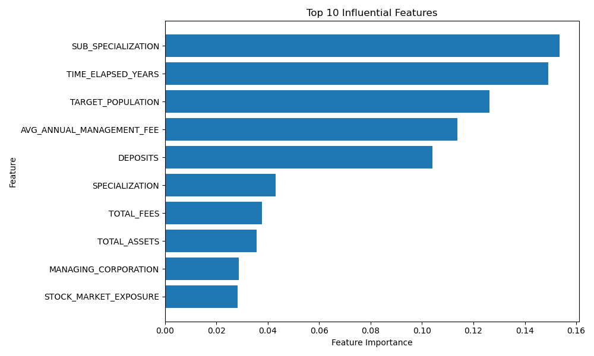
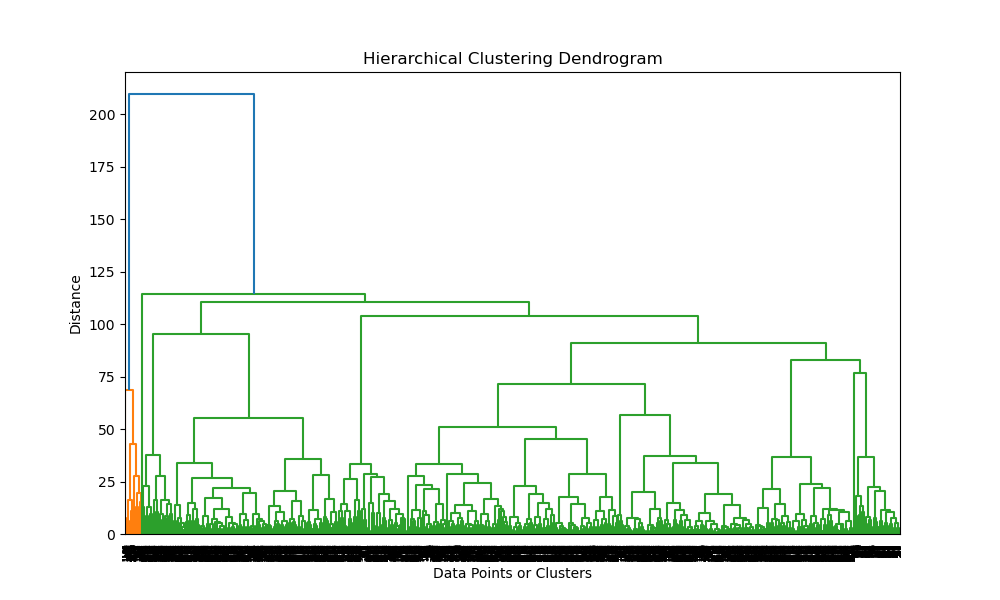
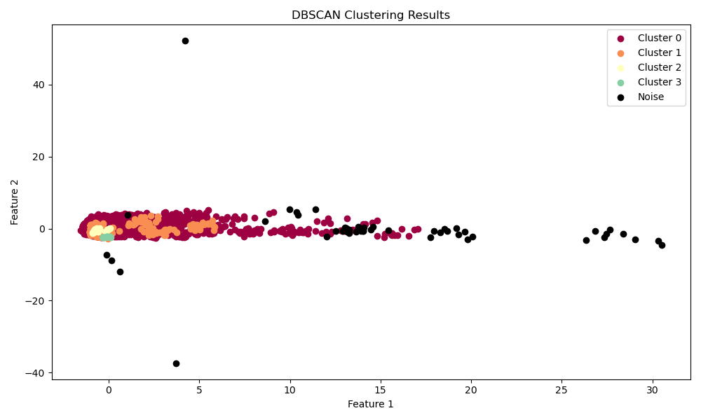
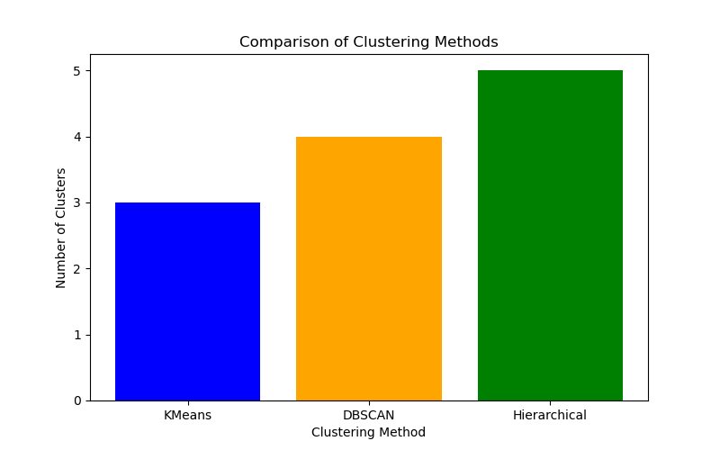

# Funds_ML

Welcome to the **Funds_ML** repository! This project processes financial fund data using various machine learning techniques. It focuses on classification, clustering, and anomaly detection workflows, covering an end-to-end machine learning pipeline with both supervised and unsupervised analysis.

## Features

This project is organized into several key functions:

### Preprocessing

- **`preprocessing`**: Cleans the dataset by handling missing values, dropping irrelevant features, engineering new features (e.g., fee buckets, time elapsed), and encoding categorical variables.

### Classification

- **`perform_classification`**: Implements multiple classifiers (Random Forest, XGBoost, Logistic Regression, K-Nearest Neighbors, Support Vector Machines).
- **`train_and_evaluate_model`**: Trains models, evaluates accuracy, F1-Score, and cross-validation scores, and outputs performance metrics.
- **`plot_comparison`**: Compares model accuracy and F1-Scores.
- **`display_feature_importance`**: Visualizes the most influential features for models like Random Forest and XGBoost.

### Clustering

- **`perform_clustering`**: Conducts clustering analysis using K-Means, Hierarchical Clustering, and DBSCAN.

### Anomaly Detection

- **`perform_anomaly_detection`**: Identifies anomalies using Isolation Forest, Local Outlier Factor, and One-Class SVM.

## Repository Structure

- `classification_pipeline.py`: Script containing the pipeline implementation.
- `feature_meaning.csv`: Describes the meaning of each feature in the dataset.
- `requirements.txt`: List of required Python libraries.
- `gemel_net_dataset.csv`: Dataset used for training and testing (not included in the repository; see below for details on dataset usage).

## Setup Instructions

### Prerequisites

Ensure you have Python 3.7+ installed along with the following libraries:

- pandas
- numpy
- scikit-learn
- xgboost
- matplotlib

### Installation

1. Clone the repository:

   ```bash
   git clone https://github.com/AronBensimhon/Funds_ML.git
   cd Funds_ML
   ```

2. Install the required Python libraries:

   ```bash
   pip install -r requirements.txt
   ```

3. Place the dataset (`gemel_net_dataset.csv`) in the root directory.

## How to Use

1. Run the script:

   ```bash
   python classification_pipeline.py
   ```

2. The script will preprocess the dataset, train multiple machine learning models, evaluate them, and visualize the results.

3. Outputs include:
   - Accuracy, F1-Score, and cross-validation accuracy for each model.
   - Clustering results with visualizations.
   - Anomaly detection results using multiple methods.

## Dataset

The dataset used in this project is from [Data.gov.il](https://info.data.gov.il/home/). It includes features related to financial fund performance, such as management fees, yields, and asset sizes. For privacy and licensing reasons, the dataset is not provided in this repository.

## Results and Outputs

### Classification
#### Model Performance Comparison


XGBoost was found to be the best-performing model with an accuracy of **98%**.
The following graph shows the top influential features for the XGBoost model:



### Clustering

Clustering analysis was performed using KMeans, Hierarchical Clustering, and DBSCAN. The results revealed distinct clusters of funds based on their attributes:

- **KMeans** identified 3 optimal clusters based on the Elbow method.


*The "elbow point" (where the reduction in WCSS becomes less significant) occurs at k=3, indicating that 3 clusters is the optimal* *choice for this dataset.*

- **Hierarchical Clustering** provided a dendrogram representation, with similar grouping as KMeans.


*The dendrogram shows how data points are merged into clusters step by step.*
*A threshold around 100 on the y-axis suggests the dataset can be grouped into a few major clusters.*
*Larger vertical distances indicate more distinct clusters, while shorter distances show similar data points merging.*

- **DBSCAN** detected 3 clusters, excluding noise points, with some outliers detected as noise.
The scatter plot below visualizes the clusters detected by the DBSCAN algorithm. Each cluster is represented by a unique color, while noise points (if any) are marked in black.



*The DBSCAN clustering visualization highlights four distinct clusters with varying densities, while noise points, represented*
*in black, are scattered across sparse regions, demonstrating the algorithm's effectiveness in identifying dense groups and outliers.*

As we can see in the following graph:


### Anomaly Detection

Anomaly detection using Isolation Forest, Local Outlier Factor (LOF), and One-Class SVM revealed the following insights:
- **Isolation Forest** detected 15 anomalies.
- **LOF** and **One-Class SVM** identified 10 and 8 anomalies respectively.
- The anomalies are primarily influenced by unusual values in features such as management fees and fund specialization.

The following graph compares the number of anomalies detected by different methods:


## Author

This repository is maintained by **Aron Bensimhon** and **Moshe Goldzand**. If you have any questions or feedback, feel free to contact us through GitHub.

